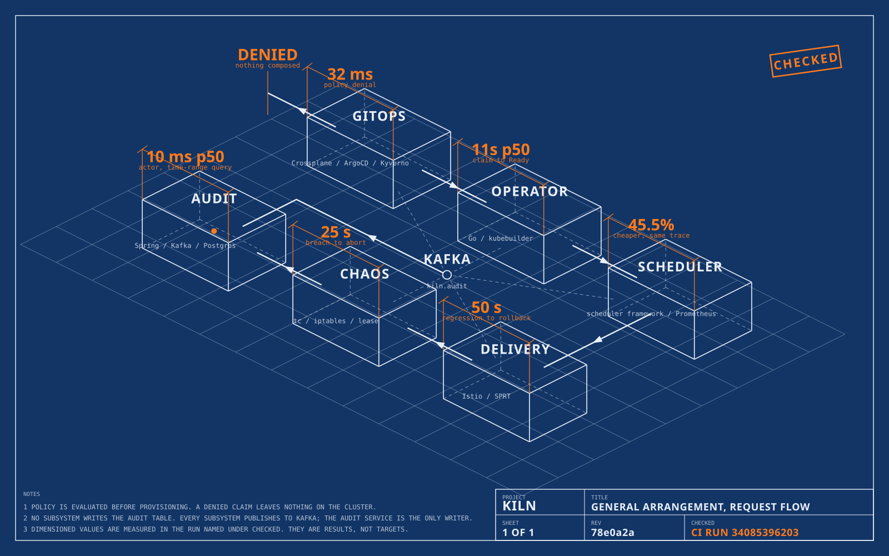

<!-- markdownlint-disable MD033 MD041 MD013 MD036 -->
<div align="center">

# kiln

**A request goes in. A hardened resource comes out.**

Self-service Kubernetes infrastructure — policy-gated, cost-placed,
canary-delivered, chaos-tested, and every step on a hash-chained audit log.

[](https://kiln-idp.vercel.app)
[](https://github.com/trnahnh/kiln/actions/workflows/ci.yaml)
[](go.work)
[](audit-service)
[](#license)

</div>
<!-- markdownlint-enable MD033 MD041 MD013 MD036 -->

Developers request infrastructure through a CRD or a thin API. The platform enforces policy
before anything is provisioned, schedules workloads with cost awareness, rolls out deployments
progressively with automatic rollback, resilience-tests services on demand, and logs every
action to a tamper-evident audit trail.

Go, Java, and declarative infrastructure, built subsystem by subsystem in eight phases,
each one gated on a criterion a CI test has to prove.

---

## The problem this solves

Without a platform layer, teams get infrastructure one of two ways: a ticket to a platform engineer (hours to days per request, gated on a human being available), or raw Terraform/kubectl written by the requesting developer (fast, but inherits every way to get security, cost, and reliability wrong). Neither scales past a small team, and neither leaves a real audit trail when compliance asks who provisioned what and who approved it.

This platform replaces both paths with one: request through a CRD, get policy-checked, provisioned, scheduled, deployed, and logged automatically.

Full problem writeup and the baseline this platform is measured against: [`docs/METRICS.md`](docs/METRICS.md). The landing page, a drawing of the request flow dimensioned with the validation numbers, is at [kiln-idp.vercel.app](https://kiln-idp.vercel.app) and lives in [`web/`](web/README.md).

---

## What's in this repo

| Subsystem | What it does | Stack |
|---|---|---|
| Operator | Provisions and lifecycle-manages per-tenant Postgres/Redis instances via a custom CRD | Go, kubebuilder, controller-runtime |
| Provisioning / GitOps | Translates a request into real cloud resources, deployed declaratively through Git | Crossplane, ArgoCD, Terraform |
| Policy | Validates every request against org rules before it reaches the operator | OPA, Kyverno |
| Scheduler plugin | Places pods with cost/fragmentation-aware scoring instead of default bin packing | Go, Kubernetes scheduler framework |
| Progressive delivery | Canary rollout with automatic, statistically-gated rollback | Go, Istio, Prometheus |
| Chaos / resilience | On-demand controlled failure injection with an automated SLO-based score | Go, Istio/Prometheus, tc/iptables |
| Audit / RBAC | Tamper-evident audit trail and access control in front of the whole platform | Java, Spring Boot, Kafka, PostgreSQL |

Full design rationale and the hard problem each one solves: [`docs/SYSTEM_DESIGN.md`](docs/SYSTEM_DESIGN.md).

---

## Architecture

<!-- markdownlint-disable MD033 MD013 -->
<div align="center">

[](https://kiln-idp.vercel.app)

</div>
<!-- markdownlint-enable MD033 MD013 -->

The request runs GitOps, operator, scheduler, delivery, chaos, audit. A claim the policy gate denies stops before anything is composed. No subsystem writes the audit table: every one of them publishes to Kafka, and the audit service holds the only write credentials.

The sheet is generated, not drawn. `web/scripts/build-draft.ts` renders it from the same line model as the landing page, with every dimension stamped in from [`docs/METRICS.md`](docs/METRICS.md); CI rebuilds it and fails on any drift, so it cannot go stale against the numbers it quotes.

---

## Tech Stack

<!-- markdownlint-disable MD033 MD013 -->
<div align="center">


</div>
<!-- markdownlint-enable MD033 MD013 -->

| Layer | Technology |
|---|---|
| Operator | Go, kubebuilder, controller-runtime, envtest |
| Scheduler | Go, Kubernetes scheduler framework (out-of-tree plugin) |
| Delivery | Go, Istio VirtualService traffic shifting, sequential probability ratio test — ADR-0014 |
| Chaos | Go, node agent driving `tc`/`iptables`, lease-backed dead-man switch — ADR-0015 |
| Audit / RBAC | Java 21, Spring Boot, Kafka consumer, PostgreSQL, RS256 JWT |
| Provisioning | Crossplane v2 namespaced XRs, ArgoCD app-of-apps, Terraform |
| Policy | Kyverno fail-closed validating policies (CEL), OPA |
| Event stream | Kafka, single-node KRaft locally |
| Observability | Prometheus, Grafana, Jaeger; one OpenTelemetry trace per request — ADR-0021 |
| Tests | Go unit and envtest, Gradle/JUnit, a tagged end-to-end suite against a live `kind` cluster |
| CI | GitHub Actions, unit and integration jobs per module plus a full-cluster `platform-e2e` |
| Landing page | Next.js App Router, React, Tailwind, TypeScript, deployed on Vercel |

---

## Repo layout

```
.
├── operator/              # Go, kubebuilder-scaffolded TenantDatabase operator
├── gitops/
│   ├── argocd/            # App-of-apps bootstrap and one Application per component
│   ├── compositions/      # Crossplane Compositions and XRDs
│   ├── policies/          # OPA/Kyverno policy definitions
│   ├── observability/     # Prometheus, Grafana and Jaeger as plain manifests
│   ├── kafka/             # Single-node KRaft broker for the audit event stream
│   ├── audit/             # Audit Postgres and the audit service
│   └── tenants/           # Per-team DatabaseClaims, the Git request path
├── scheduler-plugin/      # Go, Kubernetes scheduler framework plugin
├── delivery-controller/   # Go, canary rollout + rollback decision logic
├── chaos/                 # Go, fault injection + SLO scoring
├── audit-service/         # Java/Spring Boot, Kafka consumer, hash-chained audit API
├── audit/                 # Go, shared publisher every controller emits audit events through
├── slo/                   # Go, shared Istio/Prometheus SLO metric reader
├── tracing/               # Go, shared OpenTelemetry setup and trace propagation
├── e2e/                   # Go, per-phase exit-criterion tests against the live cluster
├── hack/                  # Out-of-Git bootstrap: audit Secrets and the JWT key pair
├── web/                   # Landing page, live at https://kiln-idp.vercel.app; its numbers are pulled from docs/METRICS.md
├── docs/
│   ├── SYSTEM_DESIGN.md
│   ├── API_REFERENCE.md
│   ├── DATA_MODEL.md
│   ├── METRICS.md
│   ├── ROADMAP.md
│   ├── TESTING.md
│   ├── decisions/         # ADRs, immutable once accepted
│   └── assets/            # The architecture sheet, rendered by web/scripts/build-draft.ts
└── README.md
```

---

## Getting started (local dev)

Prerequisites: `kind`, `kubectl`, Go 1.26+, Java 21+, Docker.

```bash
# 1. Bring up a local cluster; kind's default StorageClass must allow the
#    volume growth that TenantDatabase scaling relies on
kind create cluster --config kind-config.yaml
kubectl patch storageclass standard -p '{"allowVolumeExpansion":true}'

# 2. Stand up observability
kubectl apply -f gitops/observability/

# 3. Build the operator, the cost-aware scheduler, the delivery controller, the chaos and
#    the audit service images and hand them to kind; ArgoCD deploys them but never pulls them
make -C operator docker-build kind-load
make -C scheduler-plugin docker-build kind-load
make -C delivery-controller docker-build kind-load
make -C chaos docker-build kind-load
make -C audit-service docker-build kind-load

# 4. Create what Git must not hold: the audit Postgres credentials and the JWT public key
#    the audit service verifies tokens with. The private key stays in hack/keys/, gitignored.
bash hack/audit-secrets.sh

# 5. Bootstrap ArgoCD; from here Git installs the TenantDatabase, CanaryRollout and
#    ChaosExperiment CRDs, Crossplane, Kyverno, Istio, Kafka, the operator, the
#    kiln-scheduler, the delivery controller, the chaos controller and agent, the audit
#    Postgres and service, the DatabaseClaim composition, the admission policies and
#    tenant claims
kubectl apply -k gitops/argocd/install --server-side
kubectl -n argocd rollout status statefulset/argocd-application-controller
kubectl apply -f gitops/argocd/root.yaml

# 6. Optional: run the operator from the host instead of the in-cluster one, for a fast
#    edit-run loop. Park the ArgoCD-managed copy first so two managers do not compete
kubectl -n kiln-operator-system scale deployment/kiln-operator-controller-manager --replicas=0
cd operator && make run
```

### Using the platform

Pods opt into cost-aware placement with `schedulerName: kiln-scheduler` and declare their class with the `kiln.platform.internal/workload-class` label; see `docs/API_REFERENCE.md`.

Request a database by committing a `DatabaseClaim` under `gitops/tenants/<team>/`; the org rules it must satisfy live in `gitops/policies`.

Roll a Deployment out as a canary by labelling its namespace `istio-injection=enabled`, giving it a Service of the same name, and creating a `CanaryRollout` that names it; every later change to its pod template is analysed and either promoted or rolled back. Schema in `docs/API_REFERENCE.md`.

Run a chaos experiment against a meshed service (target and callers in an `istio-injection=enabled` namespace) by creating a `ChaosExperiment` that selects its pods, names a fault type, and declares the SLOs that auto-abort it. The blast radius is capped at `maxReplicaPercentage` of the matching pods, enforced by the node agent; the experiment produces a resilience score, and a breach of `abortOnSLOBreach` reverts every fault within a bounded window. Schema in `docs/API_REFERENCE.md`.

Every action above lands in the audit trail: each controller publishes a wire event to the Kafka topic `kiln.audit`, and the audit service, the only writer of the audit table, hash-chains it into `audit_entry` (`docs/DATA_MODEL.md`). Query it with `GET /v1/audit`, verify the chain with `GET /v1/audit/verify`, or submit a request on your own behalf with `POST /v1/requests`; roles and endpoints are in `docs/API_REFERENCE.md`. Tokens are RS256 JWTs signed with the private key `hack/audit-secrets.sh` generated; `e2e/phase6_test.go` shows how one is minted.

### Changing a CRD

Git owns every CRD on the cluster: the `kiln-platform` Application delivers them from `origin/main` with `selfHeal` on (ADR-0012), so a CRD you `kubectl apply` locally is reverted at ArgoCD's next sync, usually within minutes. A schema change (a new field, a new phase, a new enum value) therefore only takes effect on the local cluster after it has been pushed to `origin/main`; until then the API server rejects the controller's writes that use it and a local end-to-end run fails for that reason alone. The workflow for any CRD change is: regenerate (`make manifests` in the module), prove the reconciler under `envtest` which loads the CRD from the working tree, commit, push, wait for `kiln-platform` to show Synced, then run the end-to-end test. CI always proves the change on a fresh cluster whether or not the local run happened.

To iterate on a CRD locally without pushing, pause self-healing on the platform Application, apply the CRD by hand, and restore the policy when done:

```bash
kubectl -n argocd patch application kiln-platform --type=merge -p '{"spec":{"syncPolicy":{"automated":{"prune":true,"selfHeal":false}}}}'
kubectl apply -f <module>/config/crd/bases/
# ... iterate ...
kubectl -n argocd patch application kiln-platform --type=merge -p '{"spec":{"syncPolicy":{"automated":{"prune":true,"selfHeal":true}}}}'
```

ArgoCD reports the Application OutOfSync while the local CRD differs from Git; that is expected and clears once the change is pushed.

### Host caveats

**Windows hosts.** `crossplane render` (the offline composition check in `docs/TESTING.md`) has no Windows build and needs Docker. Locally it only works from WSL running as root with `DOCKER_HOST=unix:///mnt/wsl/docker-desktop/shared-sockets/guest-services/docker.proxy.sock`. CI runs it natively on Linux with no such requirement.

**Chaos latency injection under WSL2.** The `latency-injection` fault needs the `sch_netem` kernel module, which the WSL2 kernel does not ship. On a kind cluster running under WSL2, latency injection fails to apply (`tc ... Error: Specified qdisc kind is unknown`) and the experiment aborts rather than scoring, so this fault cannot be verified locally on such a host. The other faults (pod-kill, network-partition, resource-exhaustion) work locally; CI runs on a stock Linux kernel with `sch_netem`, so `TestPhase5Chaos` proves latency there.

---

## Documentation

| Document | Description |
|---|---|
| [docs/SYSTEM_DESIGN.md](./docs/SYSTEM_DESIGN.md) | Architecture, request flow, the design problem each subsystem solves |
| [docs/API_REFERENCE.md](./docs/API_REFERENCE.md) | CRD schemas, REST endpoints, audit event schema, error codes |
| [docs/DATA_MODEL.md](./docs/DATA_MODEL.md) | The audit table, its DDL, and the hash-chain rule |
| [docs/METRICS.md](./docs/METRICS.md) | Baseline vs. target per subsystem, measurement methodology, validation plan and results |
| [docs/ROADMAP.md](./docs/ROADMAP.md) | Build phases and the exit criterion each one is gated on |
| [docs/TESTING.md](./docs/TESTING.md) | Testing approach per subsystem, and how to run each suite |
| [docs/decisions/](./docs/decisions/) | ADRs for every design decision, immutable once accepted |
| [web/README.md](./web/README.md) | The landing page: the drawing, where its numbers come from, how it is verified |

---

## Invariants

These hold structurally rather than by convention, and changing one takes an ADR that supersedes the existing one. The load-bearing ones:

- Policy evaluation happens before provisioning, enforced by admission webhook ordering, never by an application-level flag that could be skipped.
- No subsystem writes to the audit table. Every subsystem publishes to Kafka; the audit service is the only holder of write credentials, and the hash chain plus the `eventId` uniqueness constraint are the only tamper-evidence and dedup mechanisms.
- A chaos experiment's blast radius is enforced by the injection mechanism itself, and `abortOnSLOBreach` cannot be disabled per experiment.
- A resilience score is reported only for a fault confirmed to have landed. A failed injection aborts the experiment; a default score is never produced.

Correctness claims are verified against independent ground truth, meaning actual cluster state, actual Kafka topic contents, actual billed instance-hours, never against a subsystem's own status field.

---

## Status

Phases 0 through 7 have met their exit criteria. The final validation ran the whole platform as one synthetic week of developer requests on a fresh five-node cluster; the resulting comparison table against the baselines, and the CI run that produced it, are in [`docs/METRICS.md`](docs/METRICS.md#validation-results).

See [`docs/ROADMAP.md`](docs/ROADMAP.md) for the phase tracker and what each phase had to prove.

---

## License

Apache License 2.0. See [LICENSE](LICENSE).
